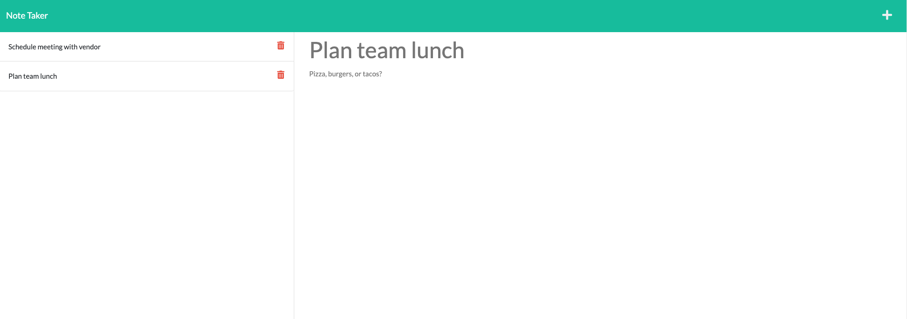

# Homework 11: Note Take

## Description

I created a note-taking application with the below functionality:

* Upon opening the application, the user is presented with a landing page introducing the application. The user can then click on the "Get Started" link, taking them to a notes page.
* On the notes page, previously saved notes are displayed in the left pane. Clicking on each note will open the note title and text toward the right side of the screen (read-only).
* Upon clicking the "plus" icon, the user can enter a new note title and description and then click the disk icon to save the note. Saving the note will add it to the other saved notes in the left pane.

## Screenshots of the application

## Technologies used

This application utilizes these technologies:

* Node.js
* JavaScript
* The [Express package](https://www.npmjs.com/package/express)
* Deployment on the [Heroku cloud platform](https//www.heroku.com)
* HTML
* The Bootstrap CSS framework

## Contact information

* Website: https://jaymoses01.github.io/hw-08-updated-portfolio-page/
* Email: JayRMoses@gmail.com

## MIT license

Permission is hereby granted, free of charge, to any person obtaining a copy
of this software and associated documentation files (the "Software"), to deal
in the Software without restriction, including without limitation the rights
to use, copy, modify, merge, publish, distribute, sublicense, and/or sell
copies of the Software, and to permit persons to whom the Software is
furnished to do so, subject to the following conditions:

The above copyright notice and this permission notice shall be included in all
copies or substantial portions of the Software.

THE SOFTWARE IS PROVIDED "AS IS", WITHOUT WARRANTY OF ANY KIND, EXPRESS OR
IMPLIED, INCLUDING BUT NOT LIMITED TO THE WARRANTIES OF MERCHANTABILITY,
FITNESS FOR A PARTICULAR PURPOSE AND NONINFRINGEMENT. IN NO EVENT SHALL THE
AUTHORS OR COPYRIGHT HOLDERS BE LIABLE FOR ANY CLAIM, DAMAGES OR OTHER
LIABILITY, WHETHER IN AN ACTION OF CONTRACT, TORT OR OTHERWISE, ARISING FROM,
OUT OF OR IN CONNECTION WITH THE SOFTWARE OR THE USE OR OTHER DEALINGS IN THE
SOFTWARE.